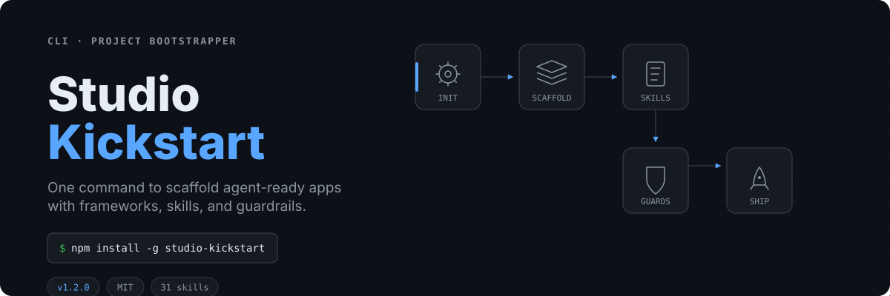
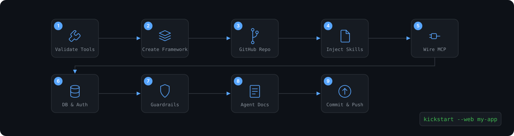

<p align="center">
  
</p>

<p align="center">
  <a href="https://www.npmjs.com/package/studio-kickstart"></a>
  = 20">
  
  
</p>

One CLI to scaffold a complete project — framework, database, auth, agent skills, MCP servers, quality gates, and docs — so you never rebuild the same setup twice.

```
kickstart --web my-app
```

That single command creates a Next.js app with Supabase, Better-Auth, Husky, Vitest, Playwright, Prettier, Sandcastle, pre-wired MCP servers, and agent instructions for Claude Code, Codex, and Gemini CLI.

---

<p align="center">
  
</p>

### Install

```bash
npm install -g studio-kickstart
kickstart --init
```

### Create a project

**Interactive** — prompts for stack, name, local model mode, and GitHub mode:

```bash
kickstart
```

**Scripted** — specify everything up front:

```bash
kickstart --web my-app --github skip
kickstart --mobile my-mobile-app --github private
kickstart --universal my-platform --github public
kickstart --other my-app --github skip
```

### Choose what gets installed

```bash
# Select specific skill packs
kickstart --web my-app --skill-pack essential,security

# Install the full 31-skill library
kickstart --web my-app --all-skills

# Wire specific MCP servers (or skip them)
kickstart --web my-app --mcp supabase,github,filesystem
kickstart --web my-app --mcp none

# Pin skills to a specific release
kickstart --web my-app --skills-ref v1.2.0

# Use a custom skills repository
kickstart --skills https://github.com/your-org/your-skills.git --web custom-app
```

---

<p align="center">
  
</p>

Every scaffolded project includes a consistent, production-grade setup:

| Layer | What you get |
| --- | --- |
| **Framework** | Next.js, Expo, Turborepo + Solito, or bare (git init + pnpm init) |
| **Database** | Supabase client starter |
| **Auth** | Better-Auth starter |
| **Offline-first** | WatermelonDB starter (mobile and universal projects) |
| **Quality gates** | Husky, lint-staged, Vitest, Playwright, Prettier, Sandcastle |
| **Agent docs** | `AGENTS.md`, `CLAUDE.md`, `GEMINI.md` |
| **Skills** | Selected Studio Skill Packs in `.claude/skills/` and `.agents/skills/` |
| **Skills lockfile** | `.studio-skills.json` — tracks repo URL, ref, packs, and installed skills |
| **MCP servers** | `.claude/settings.json` pre-wired with Supabase and GitHub MCP |
| **Design staging** | `.design-staging/.gitkeep` for Open Design exports and Artifact-Pro handoffs |
| **PR pipeline** | CodeRabbit guidance for auditing Sandcastle-generated PRs |
| **Local models** | Optional guidance for Ollama, LM Studio, llama.cpp, Open WebUI |
| **Containers** | Docker Desktop, Podman, or OrbStack guidance |

<p align="center">
  
</p>

---

### Skill Packs

New projects install the **Essential Pack** by default:

| Pack | Contents |
| --- | --- |
| **Essential** | Manual-SDD, Antivibe, Watermelon Architect, Matt Pocock TypeScript, Usage Limit Reducer |
| **Agency** | Agentic SEO, Marp Slides, Spider-King lead extraction, Email Campaigns |
| **Security & Safety** | Shannon-Pro, Tech Debt Audit |
| **All Skills** | Complete library — every workflow available |

```bash
kickstart --web my-app --skill-pack essential
kickstart --web my-app --skill-pack essential,agency,security
kickstart --web my-app --all-skills
```

### Skills Sync

Every scaffold writes a `.studio-skills.json` lockfile. Re-apply or upgrade skills anytime:

```bash
# Re-apply skills from lockfile (safe, idempotent)
kickstart skills sync

# Upgrade to the latest release tag
kickstart skills sync --upgrade

# Run from any subdirectory
kickstart skills sync --project /path/to/my-app
```

<details>
<summary>Example lockfile</summary>

```json
{
  "kickstartVersion": "1.2.0",
  "repoUrl": "https://github.com/Soham407/studio-kickstart.git",
  "ref": "v1.2.0",
  "packs": ["essential"],
  "installedAt": "2026-06-01T00:00:00.000Z",
  "lastSyncedAt": "2026-06-01T00:00:00.000Z",
  "skills": [
    { "name": "manual-sdd", "category": "architecture" },
    { "name": "tdd", "category": "architecture" }
  ]
}
```

</details>

### MCP Servers

Scaffolded projects get `.claude/settings.json` pre-wired with Supabase and GitHub MCP. Replace the placeholder tokens before use:

| Server | Token |
| --- | --- |
| `supabase` | `SUPABASE_ACCESS_TOKEN` — [create at supabase.com](https://supabase.com/dashboard/account/tokens) |
| `github` | `GITHUB_TOKEN` — [create at github.com](https://github.com/settings/tokens) |
| `filesystem` | No token required |

### Agent Targets

Skills install into agent-specific discovery paths:

| Agent | Target |
| --- | --- |
| Claude Code | `.claude/skills/` |
| Codex | `.agents/skills/` |
| Pi | `.agents/skills/` |
| Portable fallback | `.agents/skills/` |

---

<p align="center">
  
</p>

Install individual skills with `kickstart skills install <name>`:

<details>
<summary><b>Architecture</b> — 22 skills</summary>

| Skill | What it does |
| --- | --- |
| `antivibe` | Explains AI-written code with curated resources |
| `caveman` | Ultra-compressed communication mode for reducing token use |
| `claude-plugin-powerpack` | Documents the recommended Claude Code plugin stack |
| `diagnose` | Reproduce, minimize, hypothesize, instrument, fix, and regression-test bugs |
| `git-guardrails-claude-code` | Sets up Claude Code hooks that block dangerous git commands |
| `grill-me` | Stress-tests a plan through focused questioning |
| `grill-with-docs` | Challenges a plan against project docs |
| `improve-codebase-architecture` | Finds deeper refactoring and architecture opportunities |
| `manual-sdd` | Applies a skills-first spec-driven development workflow |
| `migrate-to-shoehorn` | Migrates test data from `as` assertions to shoehorn |
| `prototype` | Builds throwaway terminal or UI prototypes |
| `scaffold-exercises` | Creates exercise folders with problems, solutions, and explainers |
| `setup-matt-pocock-skills` | Adds repo-level agent skill docs and issue-tracker conventions |
| `setup-pre-commit` | Adds Husky pre-commit hooks with formatting and tests |
| `tdd` | Runs a red-green-refactor loop for features and bug fixes |
| `to-issues` | Breaks plans or PRDs into implementation issues |
| `to-prd` | Turns conversation context into a PRD |
| `triage` | Triage issues through role-driven workflow states |
| `write-a-skill` | Creates new agent skills with proper structure |
| `zoom-out` | Maps an unfamiliar code area at a higher level |
| `tech-debt-audit` | Produces a file-cited codebase health and architecture audit |
| `usage-limit-reducer` | Diagnoses token usage and applies usage-reduction rules |

</details>

<details>
<summary><b>Business</b> — 5 skills</summary>

| Skill | What it does |
| --- | --- |
| `agentic-seo` | Audits documentation and websites for AI-agent discoverability |
| `email-campaigns` | Designs and sends HTML email campaigns through Resend |
| `marp-slides` | Creates MARP presentation decks with charts and themes |
| `shannon-security` | Guides white-box application security testing |
| `spider-king-lead-extraction` | Browser-independent lead collection |

</details>

<details>
<summary><b>Design</b> — 2 skills</summary>

| Skill | What it does |
| --- | --- |
| `artifact-pro-open-design` | Converts Open Design JSON exports into NativeWind v4 UI |
| `hue` | Generates new design language skills from references |

</details>

<details>
<summary><b>Coding</b> — 2 skills</summary>

| Skill | What it does |
| --- | --- |
| `matt-pocock-typescript` | Applies bundled TypeScript engineering workflows |
| `watermelon-architect` | Guides offline-first WatermelonDB synchronization design |

</details>

---

<p align="center">
  
</p>

### How Skills Work

Every installable skill follows the same shape:

```
skill-folder/
└── SKILL.md
    ├── frontmatter: name, description, type, category, tags
    ├── trigger rules: when the agent should use it
    ├── workflow: steps the agent must follow
    ├── references: optional files loaded only when needed
    └── verification: evidence required before the work is done
```

Design principles: workflow over prose, progressive disclosure, clear triggers, verifiable output.

### CLI Commands

| Command | Result |
| --- | --- |
| `kickstart --init` | Saves defaults in `~/.studio-skills/config.json` |
| `kickstart` | Guided interactive setup |
| `kickstart --web my-app` | Scaffolds Next.js with Studio defaults |
| `kickstart --mobile my-app` | Scaffolds Expo with mobile defaults |
| `kickstart --universal my-app` | Scaffolds Turborepo + Solito |
| `kickstart --other my-app` | Git init + agent setup, bring your own framework |
| `kickstart skills list` | Lists available skills from the configured repo |
| `kickstart skills install tdd` | Installs a single skill |
| `kickstart skills sync` | Re-applies skills from lockfile |
| `kickstart skills sync --upgrade` | Upgrades to the latest release |

### Project Structure

```
studio-kickstart/
├── bin/kickstart.js            # CLI entry point and flag parsing
├── lib/
│   ├── scaffold.js             # Project bootstrap orchestration
│   ├── skills.js               # Skill clone/copy/install/sync logic
│   ├── mcp.js                  # MCP server registry and config writing
│   ├── skill-catalog.js        # Skill discovery and linting
│   ├── wizard.js               # First-time setup wizard
│   ├── config.js               # ~/.studio-skills/config.json
│   └── updater.js              # npm update checks
├── architecture/               # 22 engineering workflow skills
├── coding/                     # 2 coding skills
├── business/                   # 5 business operation skills
├── design/                     # 2 design system skills
├── scripts/                    # Catalog generation and skill linting
├── test/                       # Node test runner tests
└── skills.json                 # Generated public skill catalog
```

---

### Requirements

- **Node.js 20+** and **pnpm**
- **GitHub CLI** authenticated with `gh auth login` (when using `--github private` or `--github public`)
- Docker-compatible runtime (optional, for container workloads)
- Local model runtime (optional)

### Local Development

```bash
npm install
npm test
npm run skills:lint
npm run skills:catalog
npm run check           # lint + test + pack dry-run
```

### Similar Projects

Studio Kickstart combines project scaffolding, agent skills, and guardrails into one bootstrapper:

- **Framework scaffolding** — `create-next-app`, `create-expo-app`, Solito starters
- **Opinionated setup** — `create-t3-app`
- **Agent skill packaging** — `anthropics/skills`, `openai/skills`, `addyosmani/agent-skills`
- **Agent workflows** — `obra/superpowers`
- **Sandboxed orchestration** — Matt Pocock's `sandcastle`
- **Agent environments** — Aider, OpenCode, Gemini CLI, Cline, Roo Code, Continue, Cursor, Windsurf

### Contributing

Start with [CONTRIBUTING.md](CONTRIBUTING.md) for skill structure and pull request expectations, and [ARCHITECTURE.md](ARCHITECTURE.md) for how the CLI and skills library fit together.

### License

MIT
